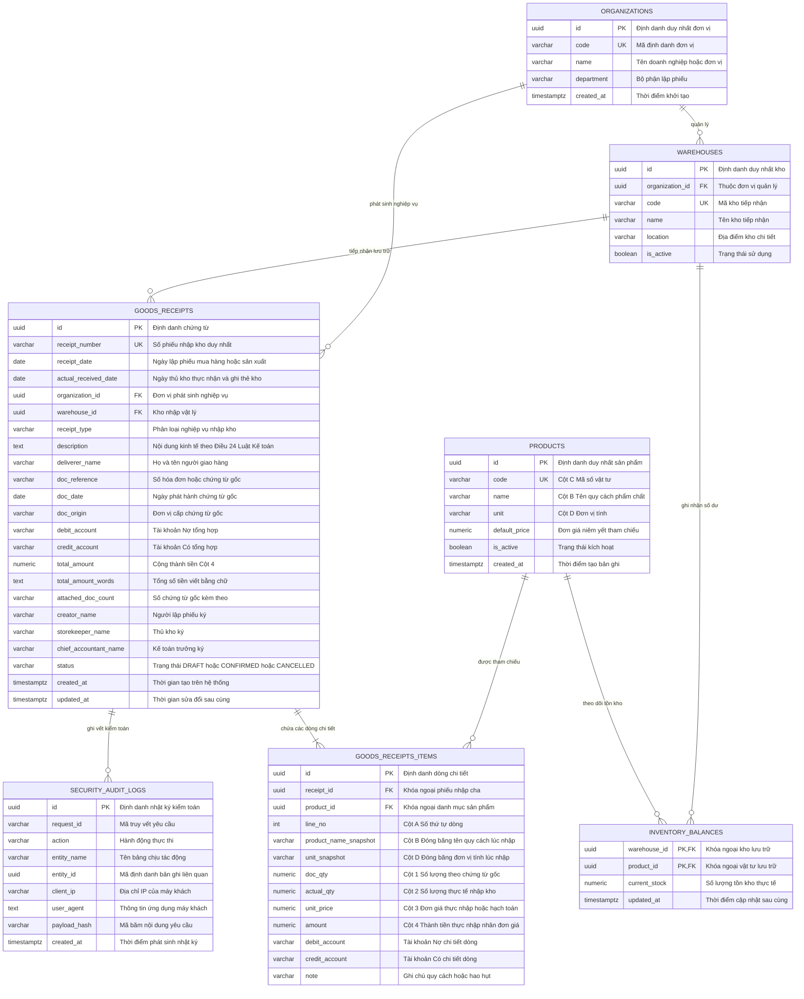
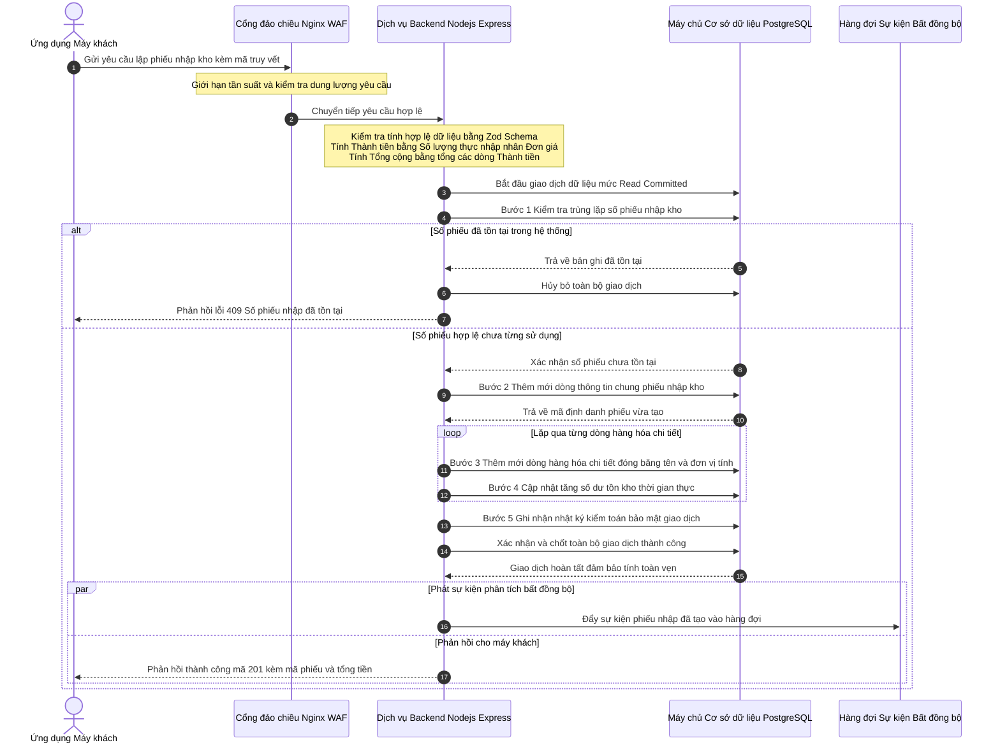
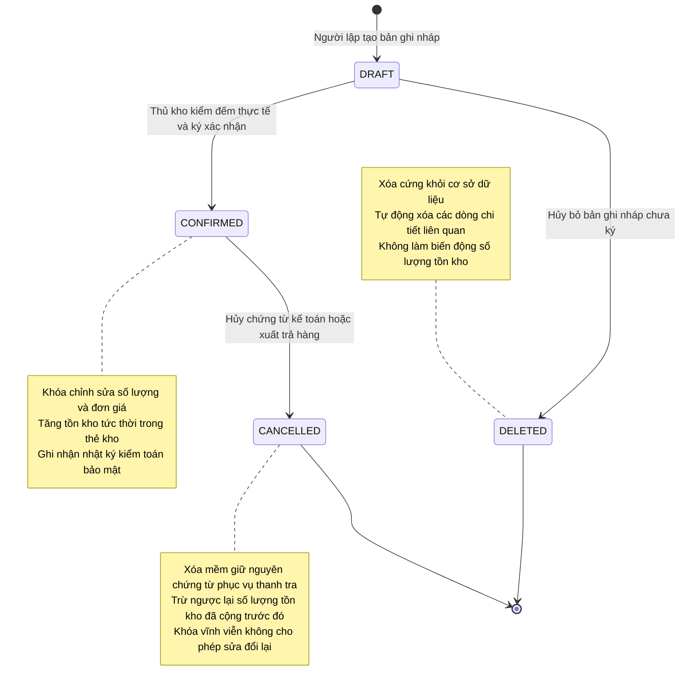
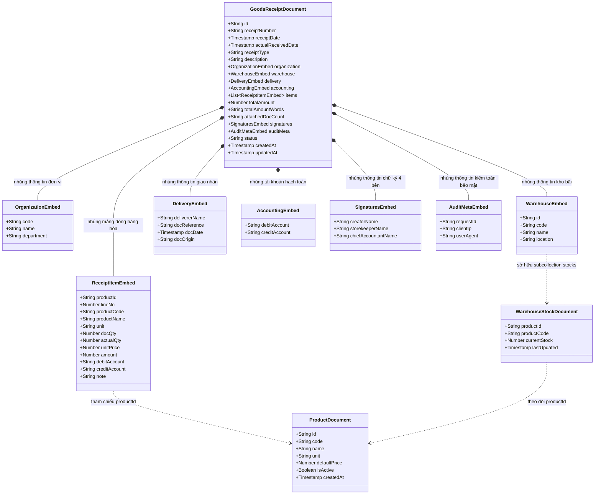
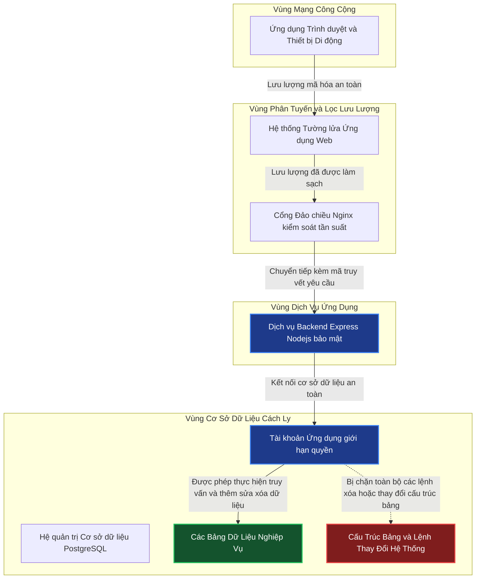

---
tags:
  - "#interview"
  - "#home-test"
  - "#2026-08-18"
  - "#mermaid"
  - "#er-chart"
---
# Tài Liệu Kỹ Thuật & Mô Hình Quan Hệ Cơ Sở Dữ Liệu Quản Lý Phiếu Nhập Kho (Mẫu 01 - VT)

Tài liệu này tổng hợp toàn bộ mô hình quan hệ thực thể (**Entity-Relationship Diagram - ERD**), luồng xử lý giao dịch dữ liệu (**Transaction & Concurrency Flow**), kiến trúc bảo mật truy cập (**Security & Access Boundary**), và vòng đời trạng thái chứng từ (**State Machine**) của cơ sở dữ liệu Quản lý Phiếu Nhập Kho, tuân thủ chuẩn mực kế toán Việt Nam (**Mẫu 01 - VT theo Thông tư 200/2014/TT-BTC** và **Điều 24, Điều 25 Luật Kế toán 2015**) cùng các chuẩn bảo mật, kiểm toán vận hành mức doanh nghiệp (Enterprise Audit & Security Standards).

## 1. Sơ Đồ Thực Thể Quan Hệ (Relational Entity-Relationship Diagram - ERD)

Mô hình dữ liệu quan hệ được chuẩn hóa 3NF kết hợp các ràng buộc khóa ngoại (Foreign Keys), ràng buộc kiểm tra (Check Constraints), bảng ghi nhận số dư tồn kho thời gian thực và bảng lưu vết kiểm toán bảo mật (`security_audit_logs`). Toàn bộ cú pháp đã được chuẩn hóa để hiển thị tốt trên mọi trình đọc Markdown (GitHub, GitLab, Obsidian, Notion).

Đoạn mã

## 2. Luồng Xử Lý Giao Dịch Cơ Sở Dữ Liệu (ACID Database Transaction Flow)

Mô hình tuần tự (Sequence Diagram) mô tả chi tiết quy trình ghi nhận Master-Detail, bảo vệ tính toàn vẹn số học, cập nhật thẻ kho và lưu vết kiểm toán trong một Database Transaction duy nhất.

Đoạn mã

## 3. Vòng Đời Trạng Thái Chứng Từ Kế Toán & Xử Lý Hoàn Kho (State Transition & Stock Reversal)

Sơ đồ trạng thái phản ánh quy tắc kiểm toán theo Thông tư 200 và Luật Kế toán: **Chứng từ đã xác nhận (`CONFIRMED`) không được xóa cứng (Hard Delete)** mà chỉ được phép hủy ghi sổ (`CANCELLED`) kèm nghiệp vụ hoàn kho (Stock Reversal).

Đoạn mã

## 4. Mô Hình Cấu Trúc Tài Liệu NoSQL (Firestore / MongoDB Schema Flow)

Mô hình cấu trúc phân cấp Document NoSQL được thiết kế phi chuẩn hóa (Denormalization) nhằm tối ưu thao tác đọc đơn lẻ (Single-Document Read) cho ứng dụng di động Flutter.

Đoạn mã

## 5. Ranh Giới Bảo Mật & Phân Quyền Cơ Sở Dữ Liệu (Security Boundary & Least Privilege)

Mô hình phân vùng an ninh cơ sở dữ liệu, phân tách rõ quyền hạn giữa các role kết nối nhằm ngăn chặn triệt để hành vi leo thang đặc quyền (Privilege Escalation) và rò rỉ dữ liệu (Data Exfiltration).

Đoạn mã

